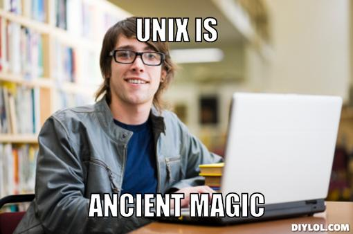
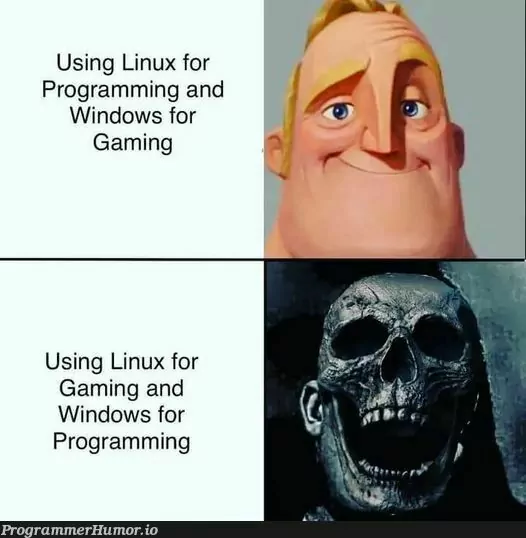
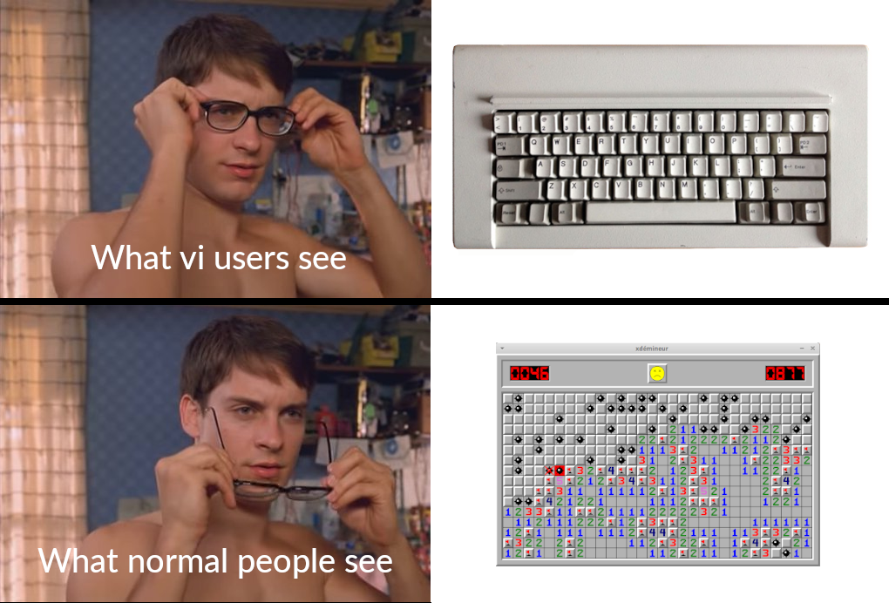

# Unix tutorial
1. What was the easiest part of the tutorial?  
The easiest part is the command about moving directory. It is just like the command in Windows.

2. What was the hardest part of the tutorial?  
The variable part is the hardest part. I need to remember the syntax and the meaning of each variable.

3. What did you learn using this tutorial?  
I learned how to use command line to create, move, copy, and delete files and directories. I also learned how to use command line to edit files.

# OpenVim tutorial
1. What was the easiest part of the tutorial?  
The easiest part is the movement keys. It is easy to remember and use.

2. What was the hardest part of the tutorial?  
The hardest part is there are so many commands other than movement keys. It is hard to remember all of them. Need to practice more.

3. What did you learn using this tutorial?  
I can edit the file without using mouse. It looks cool and professional.
# Markdown tutorial
1. What was the easiest part of the tutorial?  
Most of the skills we have already learned from the class so they are easy to understand and straight forward.

2. What was the hardest part of the tutorial?  
I think the hardest par is if I dont use it often, is hard to remember all the syntax.

3. What did you learn using this tutorial?  
Instead of using notepad or MS Word, using markdown make me difference.

# MEME

    UNIX is classic and powerful.

    It is so true.

    Yes! Command line is really hard for me.

