|Command|Discription|Example|Screenshot|
|--|--|--|--|
|`ls`|List out the contents of your current working directory, including hidden file.|`ls -a`||
|`pwd`|Show the full path of the current working directory|`pwd`|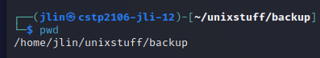|
|`cd`|Change directory to parent directory|`cd ..`|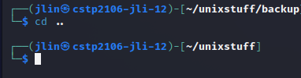|
|`touch`|Create an empty file in current working directory|`touch test.txt`|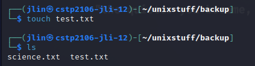|
|`cp`|Copy a file from one directory to another|`cp test.txt ..`|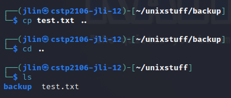|
|`rm`|Remove a file|`rm test.txt`|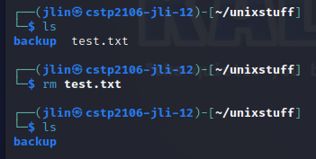|
|`mv`|Move a file to target directory|`mv test.txt ..`|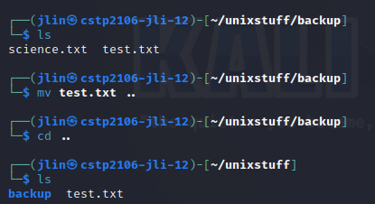|
|`mkdir`|Make a new directory|`mkdir newDir`|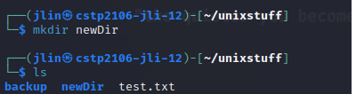|
|`rmdir`|Remove a directory|`rmdir newDir`|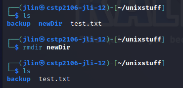|
|`top`|Show process activity|`top`|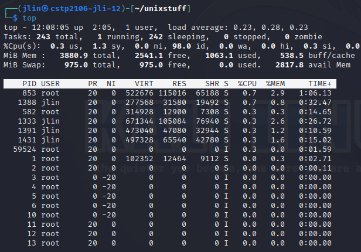|
|`cat`|Concatenate and print the contents of the file|`cat science.txt`|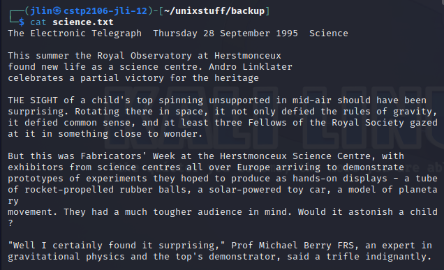|
|`head`|Print first x lines from a file|`head -5 science.txt`||
|`tail`|Print last x lines from a file|`tail -5 science.txt`||
|`less`|View a file, press spacebar to continus press q to quit|`less science.txt`|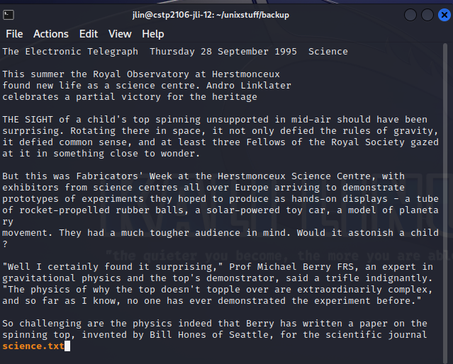|
|`grep`|Print the line matching a pattern. -i ignore upper or lower case; -v display those lines that do not match; -n precede each matching line with the line number; -c print only the total count of matched lines|`grep -ivc science science.txt`||
|`wc`|Count lines or words of the file|`wc -l` and `wc -w`|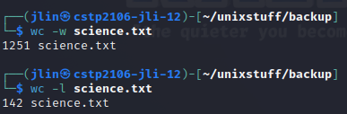|
|`tar -zxpvf`|Unzip the files|`tar -zxpvf /media/cdrom/VMwareTools-10.3..25-20206839.tar.gz`|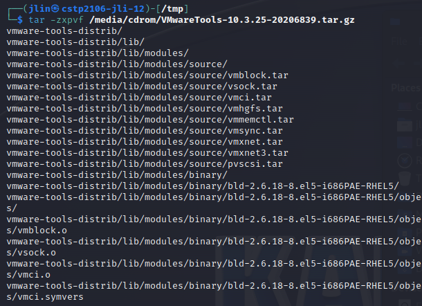|
|`apt-get install`|Install an application|`sudo apt-get install cowsay`||