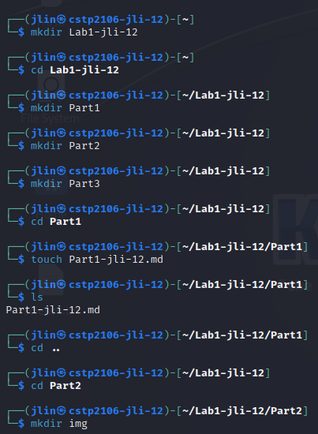
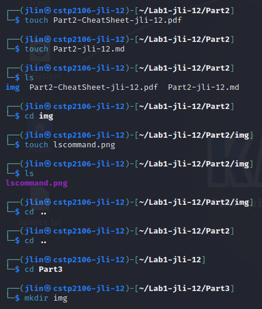
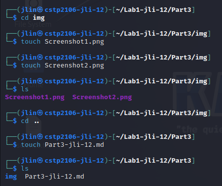
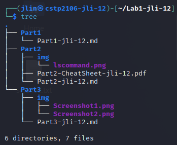
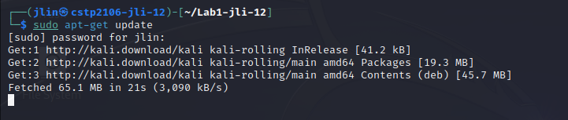
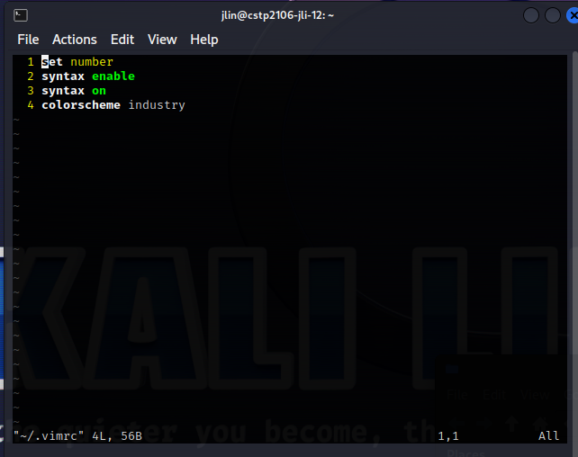

|Task|Commands|Screenshot|
|--|--|--|
|Navigate to your home directory and create a folder called Lab1-shi-89 (of course your name is not sam hill and you will use the naming convention). Using the command line create the data structure as listed in the "Submission Requirements" section of this document.|`mkdir Lab1-jli-12`, `cd Lab1-jli-12`, `mkdir Part1`, `mkdir Part2`, `mkdir Part3`, `cd Part1`, `touch Part1-jli-12.md`, `cd ..`, `cd Part2`, `mkdir img`, `touch Part2-CheetSheet-jli-12.pdf`, `touch Part2-jli-12.md`, `cd img`, `touch lscommand.png`, `cd ..`, `cd ..`, `cd Part3`, `mkdir img`, `touch Part3-jli-12.md`, `cd img`, `touch Screenshot1.png`, `touch Screenshot2.png`, `cd ~/Lab1-jli-12`, `tree`||
|Install the cowsay command, run it. Be sure to record how you installed the package via command line and then via the GUI|`sudo apt-get update`, `sudo apt-get install cowsay`, `cowsay "Hello"`||
|For vi(m) choose a theme and install it (you can search the intertubes for a theme), and some configuration settings for vim at a minimum you should turn on line numbers and syntax highlighting, also select theme of your choosing (you can do a bit of research) and install them.|`set number`, `syntax enable`, `syntax on`, `colorscheme industry`||