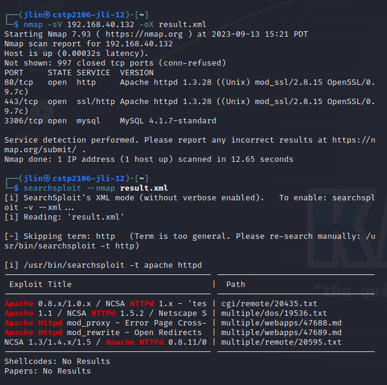

# SreenShot of searchsploit

# Vulnerabilities
## Exploit title  
Apache 0.8.x/1.0.x / NCSA HTTPd 1.x - 'test-cgi' Directory Listing

## Full path
/usr/share/exploitdb/exploits/cgi/remote/20435.txt

## Description
The problem is that if someone on the internet asks the script to do something, like show a list of files in a folder, it doesn't check if they are asking for something safe. It just goes ahead and does it.
And, if you put a star (*) in the message. This star means "do this for everything." So, instead of showing just one thing, the script shows everything it can find.

This is a big problem because it means anyone on the internet can use that star (*) to see all the files on your computer that the script can access. They can even look inside important folders and learn things they shouldn't know.

## Preventative measures
* Set up proper file and directory permissions to restrict what the CGI script can access. Ensure that the script doesn't have more privileges than it needs.
* You should validate the input that the CGI script receives, making sure it contains only safe and expected characters.
* Escape or sanitize characters that have special meanings in command execution or file operations. For example, the asterisk (*) character should not be allowed to be used as is.
* Ensure that any user-provided input is enclosed within proper quotes or handled in a way that doesn't allow it to be interpreted as a command or wildcard.

# References
* OFFSEC’s Exploit Database archive. (n.d.). https://www.exploit-db.com/searchsploit
* GeeksforGeeks. (2020). Finding Exploit offline using Searchsploit in Kali Linux. GeeksforGeeks. https://www.geeksforgeeks.org/finding-exploit-offline-using-searchsploit-in-kali-linux/
* Heynik. (2021, December 15). How to search the exploit by terminal using SearchSploit in Kali Linux. Medium. https://medium.com/@heynik/how-to-search-the-exploit-by-terminal-using-searchsploit-in-kali-linux-7a90193b3ddf